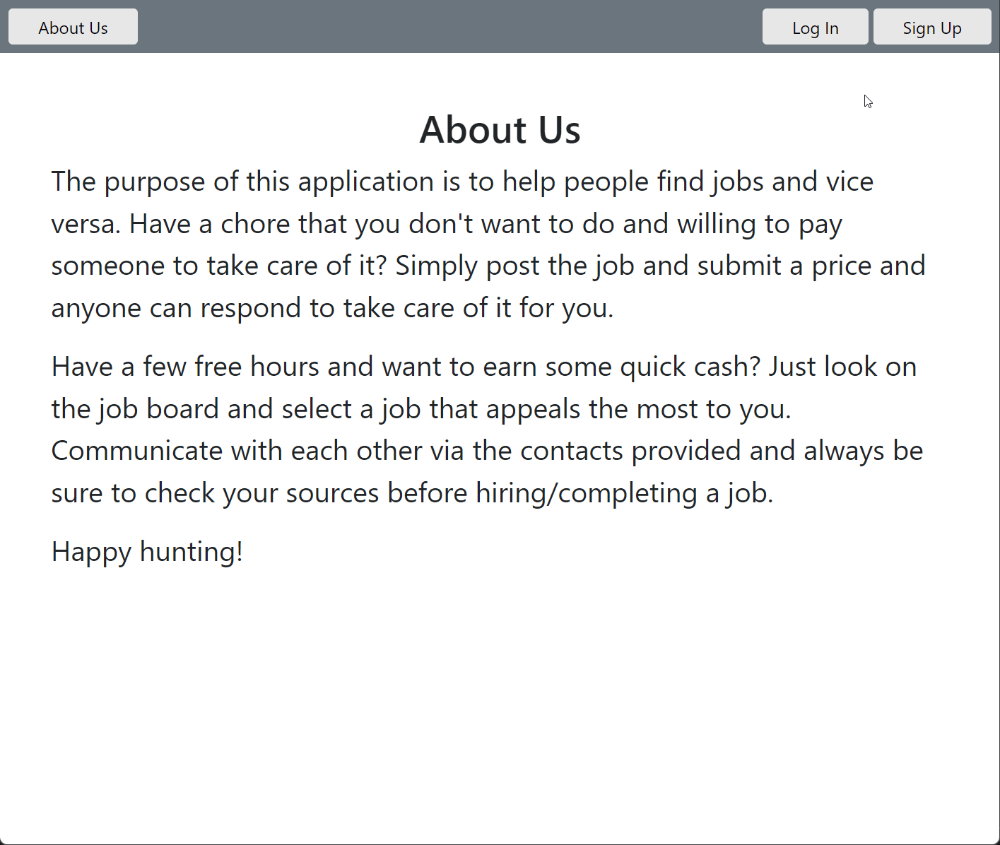
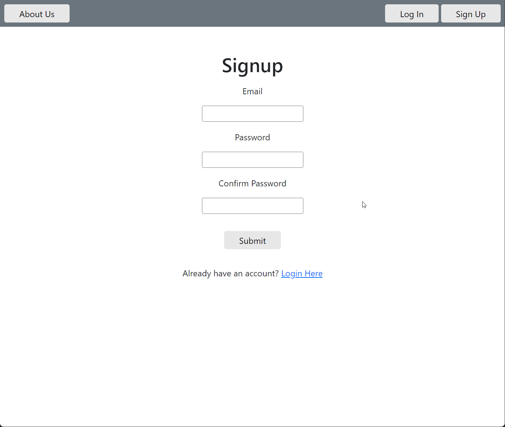
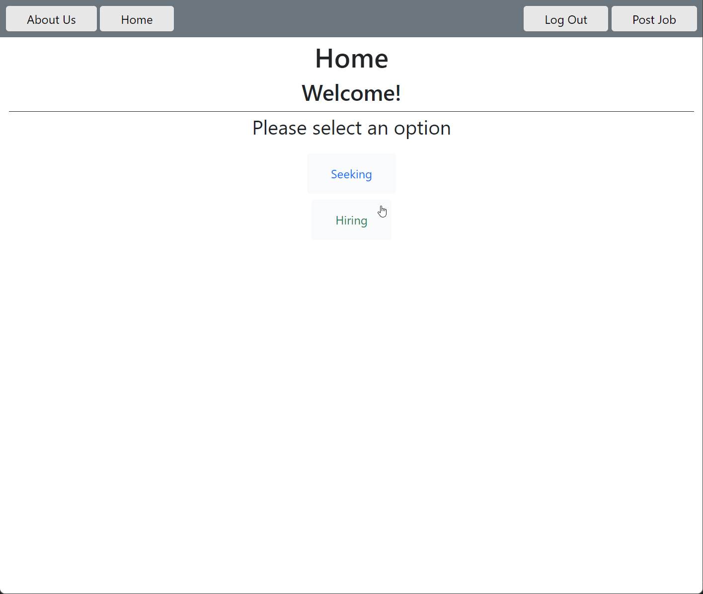

# HELP-FOR-HIRE

## Description

This application allows users to create an account on our app and allows them to search and post jobs. It's similar to [Fiverr](https://www.fiverr.com/), but instead it's for local jobs based on a zipcode for anyone who is using the app. When searching for jobs, a little card for each job with the name, price, and zipcode shows for basic information on the job which allows for quick searching.

## [Try it yourself!](https://github.com/MaestroLuu/Help-for-Hire)

Click on "Try it yourself" to get the link to the repository!

## Demo

<br>
<br>
<br>

## Installation

For the application to function, you need a coding software like the free [VScode](https://code.visualstudio.com/download), a working web browser like [Mozilla](https://www.mozilla.org/en-US/firefox/new/), a way to store databases like [MYSQL](https://www.mysql.com/downloads/), and a way to test backend software like [Insomnia](https://insomnia.rest/download). For the rest of the requirements, you will just install the required npms with ```npm i``` on the command line in the coding software you are using.

## Usage

Unless you're using this project as a boiler plate or as example code, you can instead just go straight to the [herokuapp](https://protected-taiga-32909.herokuapp.com/) instead. Otherwise you would run MYSQL with ```MYSQL -u root -p < db/schema``` in order to install the database, then you would ```.cp .env.Example .env``` in order to make a copy of the enviormental variables to input and hide your credentials, and finally you would run ```npm i``` to get the required node modules for the project. After you edit the project to your liking, you can go to the commandline and deploy it on heroku, or another server host process of your choice.

## Technology

Here is the technology used along with links to them where applicable:

- [VScode](https://code.visualstudio.com/download)
- [NodeJS](https://nodejs.org/en/)<br>
- [Insomnia](https://insomnia.rest/download)<br>
- JavaScript<br>
- [MySQL2](https://www.npmjs.com/package/mysql2)<br>
- [Sequelize](https://www.npmjs.com/package/sequelize)<br>
- [Dotenv](https://www.npmjs.com/package/dotenv)<br>
- [Express](https://www.npmjs.com/package/express)<br>
- [swup](https://www.npmjs.com/package/swup)<br>
- [Express Handlebars](https://www.npmjs.com/package/express-handlebars)

## Credits

This is the group of people who worked on this project: <br>
- Github: [David Luu](https://github.com/MaestroLuu/) 
- Github: [Marco Flores](https://github.com/JaggedComet/)
- Github: [Chris Muto](https://github.com/chrismuto/)


## Questions

If you have any additional questions regarding this application, please contact us via the channels provided below:<br />
________________________________________
Github: https://github.com/MaestroLuu<br>
Email: DLuu.developer@gmail.com<br>
________________________________________
Github:https://github.com/JaggedComet/<br>
Email: MarcoFlores1029@gmail.com<br>
________________________________________
Github: https://github.com/chrismuto/<br>
Email: chrismuto@gmail.com<br>